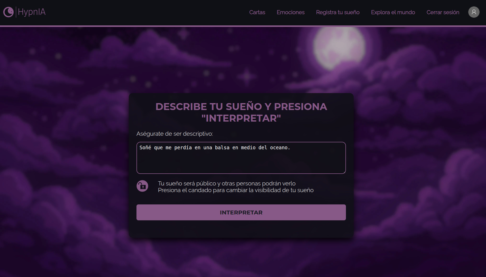

**HypnIA** es un sitio web donde los usuarios pueden registrar sus sueños, recibir interpretaciones simbólicas potenciadas por inteligencia artificial y explorar los sueños compartidos por otras personas.

---

### Tabla de contenido

- [Funcionalidades principales](#funcionalidades-principales)
- [Estructura del proyecto](#estructura)
- [Base de datos](#base-de-datos)
- [Tecnologías y librerías](#tecnologías-y-librerías)
- [Cómo levantar el proyecto](#cómo-levantar-el-proyecto)
- [Créditos](#créditos)

---

### Funcionalidades principales

- 🧠 Interpretación emocional de sueños con IA
- 📜 Registro y visualización de sueños personales
- 🌍 Feed público con sueños de otros usuarios
- 🧩 Sistema de cartas simbólicas asociadas a emociones
- 🔒 Opciones de privacidad para cada sueño
- 👤 Gestión de usuarios (registro/login)
- 🐳 Deploy con Docker Compose
- 📦 CRUD completo para todas las entidades
- 🔐 Autenticación con JWT
- 📬 Envío de correos con nodemailer

---

### Estructura

```
├── backend/
│ ├── dockerfile
│ ├── init
│ ├── src/
│ │ ├── config
│ │ ├── controladores
│ │ ├── middlewares
│ │ ├── rutas
│ │ └── utilidades
│ └── api.js
├── frontend/
│ ├── dockerfile
│ ├── assets/
│ │ ├── css
│ │ ├── images
│ │ ├── js
│ └── inicio.html
├── .env
├── docker-compose.yml
└── README.md
```

-  ` Backend ` API REST construida con Express que expone endpoints para realizar operaciones CRUD sobre sueños, emociones, cartas y usuarios.
- ` Frontend ` desarrollado con HTML, CSS y JavaScript que consume la API del backend y muestra la interfaz al usuario.
-  ` Base de datos PostgreSQL `  que se inicializa automáticamente con docker-compose.

---

### Base de datos

La base de datos del proyecto se compone de las siguientes tablas:

#### Sueños

| id_sueno | id_usuario | descripcion | fecha | publico | interpretacion | 
| -------- | ---------- | ----------- | ----- | ------- | -------------- | 
| SERIAL   | INTEGER    | TEXT        | DATE  | BOOLEAN | TEXT           | 

#### Cartas

| id_carta | nombre       | descripcion | imagen | elemento    | polaridad   |
| -------- | ------------ | ----------- | ------ | ----------- | ----------- |
| SERIAL   | VARCHAR(100) | TEXT        | TEXT   | VARCHAR(50) | VARCHAR(10) |

#### Usuarios

| id_usuario | nombre       | email        | contrasena   | fecha_registro | foto_perfil  |
| ---------- | ------------ | ------------ | ------------ | -------------- | ------------ |
| SERIAL     | VARCHAR(100) | VARCHAR(100) | VARCHAR(255) | DATE           | TEXT         |

#### Emociones

| id_emocion | nombre      | intensidad | polaridad   |
| ---------- | ----------- | ---------- | ----------- |
| SERIAL     | VARCHAR(50) | INTEGER    | VARCHAR(10) |

#### Sueños-Emociones

| id_sueno | id_emocion |
| -------- | ---------- |
| INTEGER  | INTEGER    |

#### Sueños-Cartas

| id_sueno | id_carta   |
| -------- | ---------- |
| INTEGER  | INTEGER    |

#### Cartas-Emociones

| id_carta | id_emocion |
| -------- | ---------- |
| INTEGER  | INTEGER    |

---

### Tecnologías y librerías

- HTML
- CSS
- JavaScript
- Express
- JWT
- NodeJS
- Docker
- PostgreSQL
- OpenAI API
- Dotenv
- Bcrypt
- Nodemailer
- Cors

---

## Cómo levantar el proyecto

### 🔧 Requisitos

- [Node.js](https://nodejs.org/) (v18 o superior)
- [Docker y Docker Compose](https://docs.docker.com/compose/install/)
- [Git](https://git-scm.com/)
- PostgreSQL

### Clonar el repositorio

```git clone [git@github.com:Jonas-Weimann/HypnIA.git](https://github.com/Jonas-Weimann/HypnIA.git)```

2. Moverse a la carpeta del proyercto

```cd Hypnia```

### Configurar variables de entorno (`.env`)

Crea un archivo `.env` en la raíz del proyecto y agrega lo siguiente:

```

# Base de datos
POSTGRES_DB=hypnia_database
POSTGRES_HOST=postgres
POSTGRES_PORT=5432
POSTGRES_USER=dreaming
POSTGRES_PASSWORD=dreaming1234

# JWT KEY
JWT_KEY=clave_super_segura_larga_y_dificil

# OPENAI API
OPENAI_API_KEY=clave_super_segura_larga_y_dificil

# Correo
GMAIL_USER=tu_correo@gmail.com
GMAIL_PASS=contraseña_app

```

- [¿Cómo obtener una JWT KEY?](#jwt_secret)
- [¿Cómo obtener una OPENAI API KEY?](#openai_api_key-modelo-pago)
- [¿Cómo obtener una contraseña para apps?](#gmail_user-y-gmail_pass-para-envío-de-correos)

### Levantar todos los servicios (frontend, backend y base de datos):

1. Desde la raíz del proyecto:

``` docker compose up --build ```

Esto hará:

- Levantar una base de datos PostgreSQL.
- Ejecutar automáticamente un script de inicialización (init.sql) para crear tablas y datos iniciales.
- Iniciar el backend (Express + dependencias).
- Iniciar el frontend (HTML, JS, CSS).

### Levantar servicios por separado

1. Para levantar sólo la base de datos:

``` docker compose up postgres ```

2. Para levantar sólo el backend:

``` docker compose up backend ```

3. Para levantar sólo el frontend:

``` docker compose up frontend ```

#### JWT_SECRET

Esta clave se usa para firmar y verificar los tokens JWT que maneja el backend. Debe ser larga, secreta y difícil de adivinar, por ejemplo:

```JWT_SECRET=eyJhbGciOiJIUzI1NiCI6IkpXVCJ9-miSecretoSuperLargo123```

Podés generar una desde línea de comandos con:

```openssl rand -base64 32```

#### OPENAI_API_KEY (modelo pago)
Esta variable contiene la clave de acceso a la API de OpenAI. El proyecto actualmente utiliza modelos de pago (como gpt-4), lo que implica costos según el uso.
```
⚠️ Nota: Estamos explorando opciones gratuitas o de código abierto que 
cumplan con los requisitos de calidad. En cuanto encontremos una alternativa 
viable, el sistema se actualizará para dejar de depender de modelos pagos.
```
Podés conseguir una API key en:
👉 https://platform.openai.com/account/api-keys

#### GMAIL_USER y GMAIL_PASS (para envío de correos)
El backend utiliza un correo para enviar mensajes automáticos (como verificación o recuperación de contraseña). Para que funcione correctamente:

1. Debés tener una cuenta de Gmail.
2. Activar la verificación en dos pasos.
3. Generar una contraseña de aplicación específica.

```
🔐 ¿Cómo generar una contraseña de aplicación en Gmail?
Ingresá a tu cuenta de Google: https://myaccount.google.com/
```
- Andá a ```Seguridad```.
- Activá la verificación en dos pasos si aún no lo hiciste.

Luego, dentro de la sección "Contraseñas de aplicación", seleccioná:

Aplicación: Otro (nombre personalizado) → escribí ```"Hypnia web"``` o similar.

Dispositivo: el que quieras (no importa cuál).

Google te dará una clave de 16 caracteres, usala en ```.env``` como ```GMAIL_PASS```.

Y en ```GMAIL_USER``` coloca el correo con el cual generaste esa contraseña.

---

## 🧭 Recorrido de la página
```A continuación se muestra un recorrido visual por las distintas secciones de la página:```

### Página de Inicio de sesión


### Página de Registro de usuario


### Página de Interpretaciones


### Página de Sueño Interpretado 1


### Página de Sueño Interpretado 2


### Página de Perfil


### Página de Mundo Onírico


### Página de Cartas


### Página de Emociones


---

### Créditos

Desarrollado por:

- Jonás Weimann
- Daiana Chavez
- Azul Ninaja
- Avril Mamani
